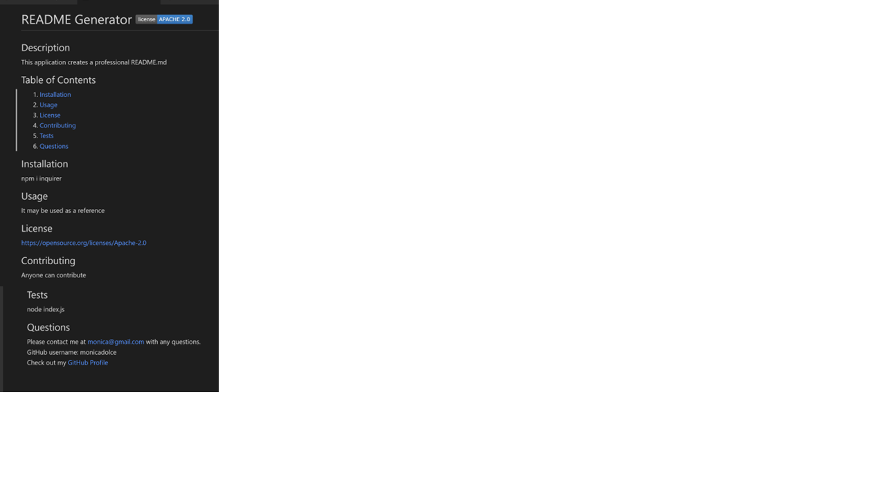

# gen_read
The application creates a README file by using a command-line application and includes what the app is for, how to use the app, how to install it, how to report issues, and how to make contributions.  The markdown file is generated inside the output folder. 

Application GitHub URL : <a href= "https://github.com/monicadolce/gen_read">Visit Monica's GitHub Repository</a> 
